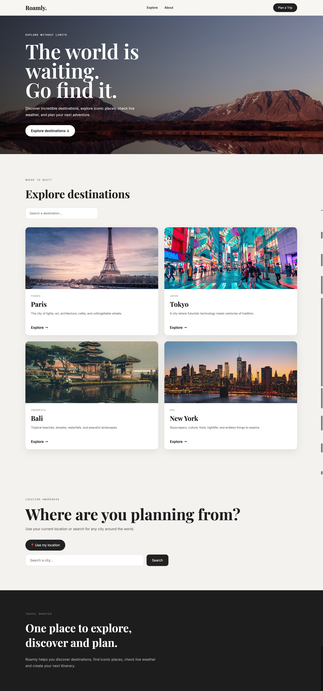
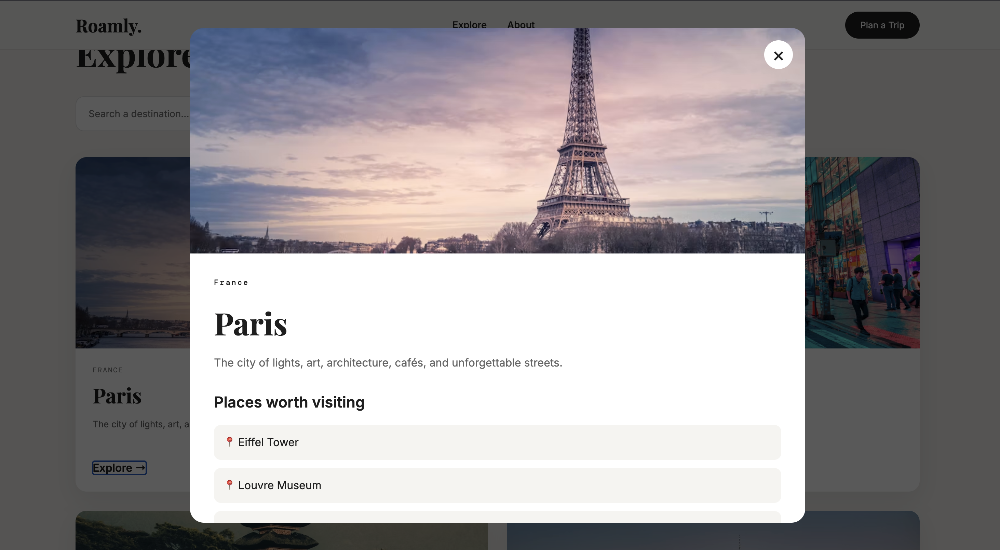
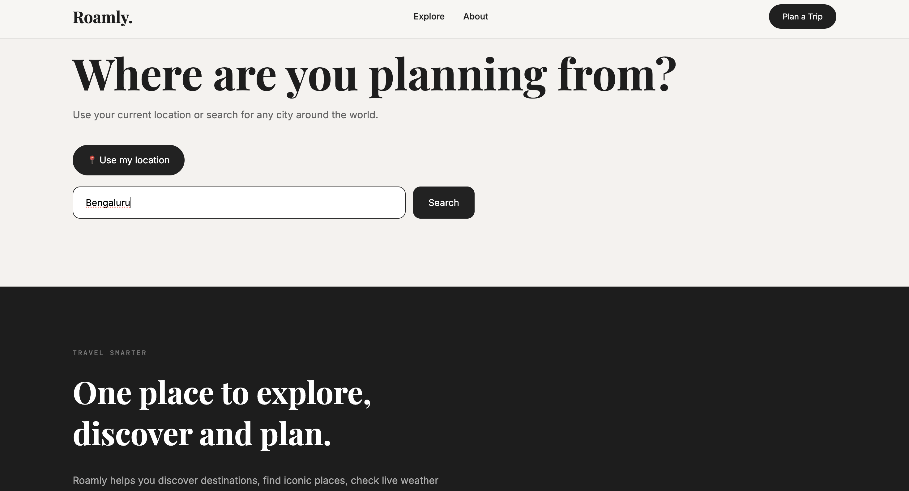
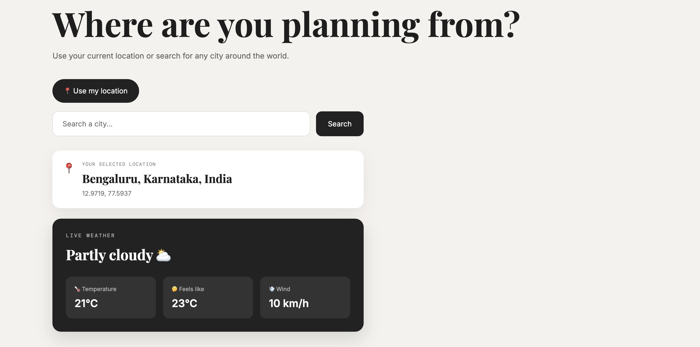
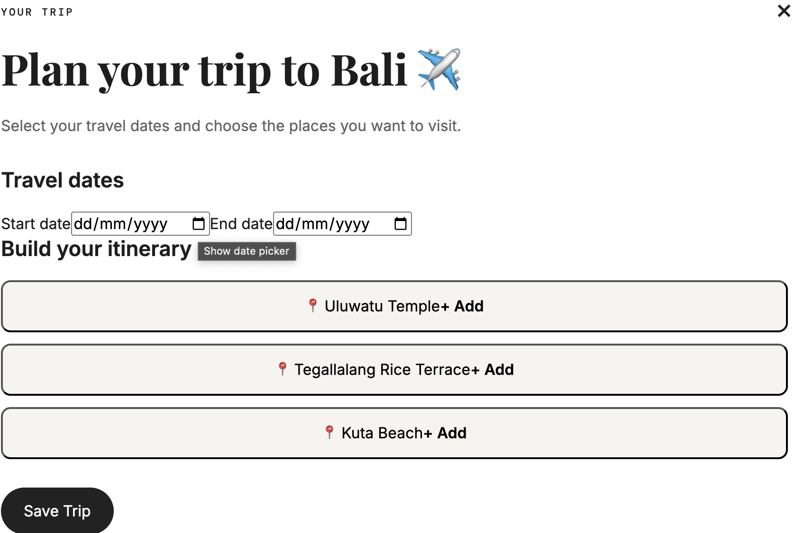
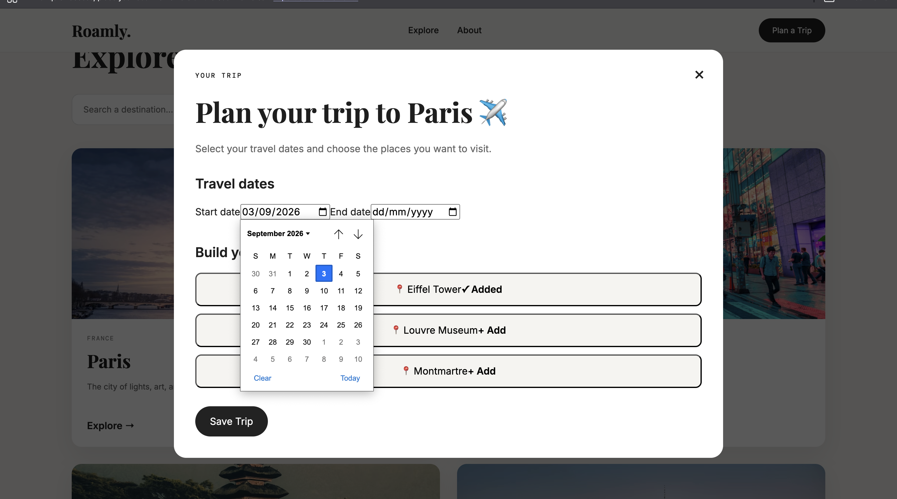
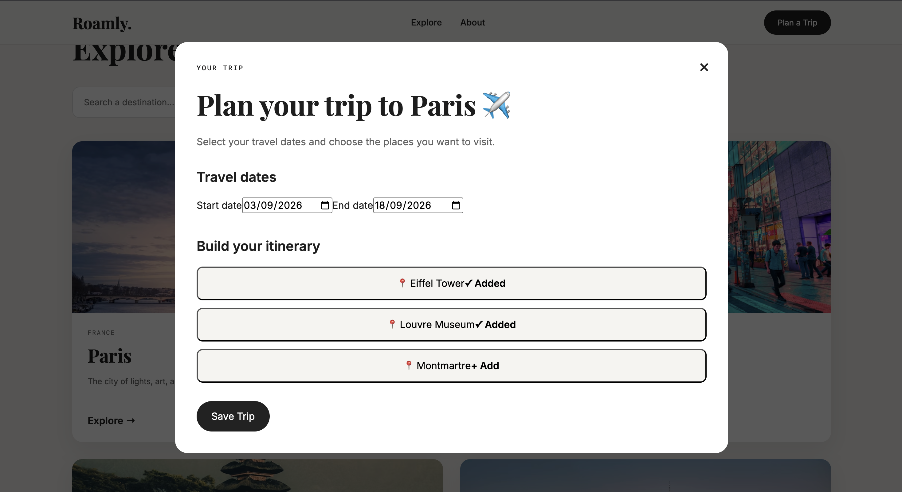

# Roamly 🌍✈️

A responsive travel discovery and trip planning web application built using React and Vite.

Roamly allows users to explore travel destinations, view destination details, search for locations, check location information and weather, and create a personalized trip itinerary.

---

## 🚀 Live Application

🔗 https://roamly-travel-app.vercel.app/

---

## 💻 GitHub Repository

🔗 https://github.com/harshavardhana-37/roamly-travel-app

---

## 📌 Overview

Roamly is a travel-focused web application designed with a clean and modern user interface.

The application provides an interactive experience where users can:

- Explore different travel destinations
- View detailed information about destinations
- Search for locations
- Use current location functionality
- View weather information
- Select travel dates
- Add destinations to a trip itinerary
- Create and save a personalized travel plan

The project focuses on responsive design, usability, and creating a visually appealing travel planning experience.

---

## ✨ Features

### 🗺️ Explore Destinations

Users can browse through different travel destinations displayed as interactive cards.

Each destination includes:

- Destination image
- Location
- Short description
- Explore option for additional details

### 🔍 Search Destinations

Users can search and filter destinations to quickly find places they are interested in.

### 📍 Location Search

The application allows users to search for locations and view location-related information.

### 🌦️ Weather Information

Weather details are displayed for selected locations to help users plan their trips.

### ✈️ Trip Planner

The trip planner allows users to:

- Select a start date
- Select an end date
- Choose destinations
- Add or remove destinations from the itinerary
- Build a personalized travel plan
- Save the trip

### 📱 Responsive Design

The application is designed to work across different screen sizes including desktop and mobile devices.

---
## 📸 Screenshots

### Homepage


### Explore Destinations


### Location Search


### Location Results & Weather


### Trip Planner


### Trip Planning


### Final Itinerary


# 🛠️ Technologies Used

- React
- JavaScript
- HTML5
- CSS3
- Vite

---

# ⚙️ Installation and Setup

Follow these steps to run the project locally:

```bash
# Clone the repository
git clone https://github.com/harshavardhana-37/roamly-travel-app.git

# Navigate into the project folder
cd roamly-travel-app

# Install dependencies
npm install

# Start the development server
npm run dev
```

Then open the localhost link Vite gives you, usually:

```text
http://localhost:5173
```
